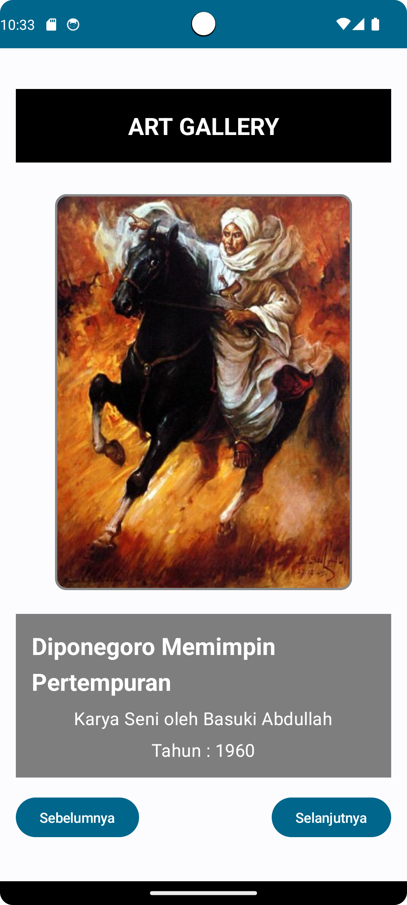
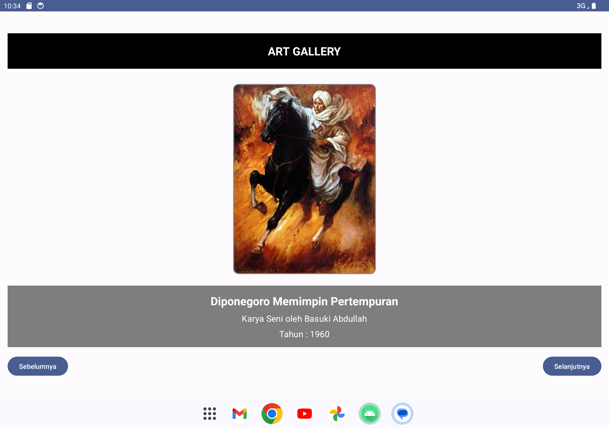

# ArtGallery
Hai, perkenalkan saya Ika Nurfitriani! Repositori ini merupakan hasil latihan projek kelas dengan referensi berasal dari codelab. Hasil projek berupa projek aplikasi Android yang diberi nama Art Gallery. Aplikasi ini menampilkan daftar karya seni lukisan beserta informasinya.

# Fitur-Fitur
- Home: Aplikasi menampilkan 5 karya seni lukisan dengan gambar, judul, deskripsi singkat, dan tahun pembuatan dari karya seni.

# Screenshot Aplikasi
Berikut ini adalah hasil screenshot dari aplikasi Art Gallery:

 

## Author
[@Ika Nurfitriani](https://github.com/ikanurfitriani)